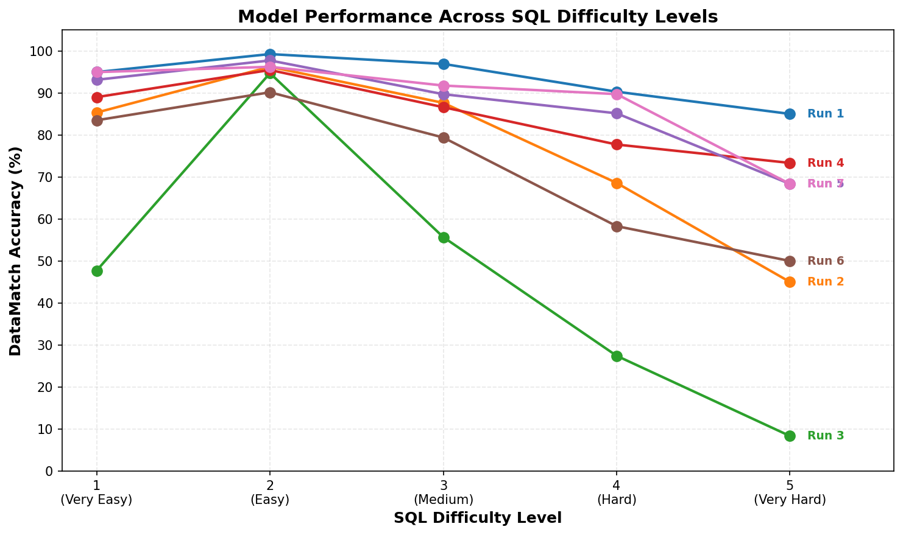

# SQL Generation Benchmark Report
**Generated**: 2026-02-10 16:39:34\
**Dataset**: mysql\
**Split**: test\
**Total Queries**: 682

---

## Metrics Explanation

### Execution Metrics

- **DataMatch**: Percentage of queries where data values are identical, ignoring column names (most meaningful for semantic correctness)
- **ExecMatch**: Percentage of queries where results are identical including both data values AND column names (most strict)
- **ExecF1**: F1 score of result set accuracy. For ordered queries: row-by-row comparison. For unordered: set-based comparison. Range: 0.0-1.0
- **Exact Match**: Percentage where result DataFrames are byte-for-byte identical (very strict, includes formatting)
- **Normalized Match**: Percentage where results match after normalization (lowercase + trimmed whitespace)

### Success Rate Metrics

- **Parse Success**: Percentage of generated SQL with valid syntax (no syntax errors)
- **Runtime Success**: Percentage of generated SQL that executes without errors (no table/column not found, type errors, etc.)

**Key Insight**: DataMatch is often the most meaningful metric as it focuses on semantic correctness while allowing different column naming conventions.

---

## Overall Summary

| Run | App Name | Service | Model | DataMatch | ExecMatch | ExecF1 | Exact Match | Normalized Match | Parse Success | Runtime Success |
|-----|----------|---------|-------|-----------|-----------|--------|-------------|------------------|---------------|----------------|
| 1 | sqlai | azure | GPT 5.2 Chat | 94.0% | 36.7% | 0.950 | 36.4% | 36.4% | 100.0% | 100.0% |
| 2 | sqlai | bedrock | anthropic.claude-3-sonnet-20240229-v1:0 | 79.9% | 37.4% | 0.816 | 36.4% | 36.4% | 100.0% | 99.1% |
| 3 | sqlai | vllm | defog/llama-3-sqlcoder-8b @ dtype bfloat16 | 49.3% | 24.8% | 0.497 | 24.3% | 24.3% | 70.5% | 66.1% |
| 4 | sqlai | caii | openai/gpt-oss-20b | 85.6% | 31.5% | 0.868 | 30.5% | 30.5% | 99.7% | 99.4% |
| 5 | sqlai | caii | Qwen/Qwen3-Coder-30B-A3B-Instruct | 89.3% | 41.3% | 0.912 | 40.5% | 40.5% | 99.9% | 99.4% |
| 6 | sqlai | caii | nvidia/llama-3.3-nemotron-super-49b-v1.5 | 74.8% | 27.6% | 0.763 | 26.0% | 26.0% | 99.4% | 96.3% |
| 7 | sqlai | openai-compatible | nvidia/nemotron-3-nano-30b-a3b | 91.1% | 36.5% | 0.925 | 35.9% | 35.9% | 99.3% | 98.7% |

### Accuracy by SQL Difficulty

This graph shows how DataMatch accuracy varies across SQL difficulty levels (1=Very Easy, 5=Very Hard) for each model.



| Model | 1 (Very Easy) | 2 (Easy) | 3 (Medium) | 4 (Hard) | 5 (Very Hard) |
|-------|-----------|-----------|-----------|-----------|-----------|
| Run 1 | 95.0% | 99.2% | 96.9% | 90.3% | 85.0% |
| Run 2 | 85.3% | 96.2% | 87.6% | 68.6% | 45.0% |
| Run 3 | 47.7% | 94.7% | 55.7% | 27.4% | 8.3% |
| Run 4 | 89.0% | 95.5% | 86.6% | 77.7% | 73.3% |
| Run 5 | 93.1% | 97.7% | 89.7% | 85.1% | 68.3% |
| Run 6 | 83.5% | 90.2% | 79.4% | 58.3% | 50.0% |
| Run 7 | 95.0% | 96.2% | 91.8% | 89.7% | 68.3% |


## Run 1: sqlai (azure - GPT 5.2 Chat)

### Core Execution Metrics

- **Data Match (Ignoring Column Names)**: 641/682 (93.99%)
  - *Same data values, ignoring column name differences*
- **Execution Accuracy (ExecMatch)**: 250/682 (36.66%)
  - *Exact match including column names*
- **Average ExecF1**: 0.9504
- **Exact Text Match**: 248/682 (36.36%)
- **Normalized Match**: 248/682 (36.36%)
### Execution Success Rates

- **Parse/Compile Success**: 682/682 (100.00%)
- **Runtime Success**: 682/682 (100.00%)

## Run 2: sqlai (bedrock - anthropic.claude-3-sonnet-20240229-v1:0)

### Core Execution Metrics

- **Data Match (Ignoring Column Names)**: 545/682 (79.91%)
  - *Same data values, ignoring column name differences*
- **Execution Accuracy (ExecMatch)**: 255/682 (37.39%)
  - *Exact match including column names*
- **Average ExecF1**: 0.8155
- **Exact Text Match**: 248/682 (36.36%)
- **Normalized Match**: 248/682 (36.36%)
### Execution Success Rates

- **Parse/Compile Success**: 682/682 (100.00%)
- **Runtime Success**: 676/682 (99.12%)

### Error Categories

| Error Type | Count | Percentage |
|------------|-------|------------|
| Runtime Error | 6 | 0.88% |

### Error Examples

#### Runtime Error

**Example 1:**

- **Question**: What are the death and injury situations caused by the ship with tonnage 't'?
- **Gold SQL**: ```SELECT `t1`.`killed`, `t1`.`injured` FROM `death` AS `t1` JOIN `ship` AS `t2` ON `t1`.`caused_by_ship_id` = `t2`.`id` WHERE `t2`.`tonnage` = 't'```
- **Generated SQL**: ```SELECT caused_by_ship_id, killed, injured
         FROM battle_death.death
         WHERE caused_by_ship_id = (
           SELECT id
           FROM battle_death.ship
           WHERE tonnage = 't'
         );```
- **Error**: (mysql.connector.errors.DataError) 1242 (21000): Subquery returns more than 1 row
[SQL: SELECT caused_by_ship_id, killed, injured
         FROM battle_death.death
         WHERE caused_by_ship_id = (


**Example 2:**

- **Question**: What is the maker of the carr produced in the earliest year and what year was it?
- **Gold SQL**: ```SELECT `t2`.`Make`, `t1`.`Year` FROM `cars_data` AS `t1` JOIN `car_names` AS `t2` ON `t1`.`Id` = `t2`.`MakeId` WHERE `t1`.`Year` = (SELECT MIN(`YEAR`) FROM `cars_data`)```
- **Generated SQL**: ```SELECT cm.Maker, MIN(cd.Year) AS EarliestYear
FROM car_1.car_makers cm
JOIN car_1.model_list ml ON cm.Id = ml.Maker
JOIN car_1.cars_data cd ON ml.Model = cd.Model
GROUP BY cm.Maker
ORDER BY EarliestYear ASC
LIMIT 1;```
- **Error**: (mysql.connector.errors.ProgrammingError) 1054 (42S22): Unknown column 'cd.Model' in 'on clause'
[SQL: SELECT cm.Maker, MIN(cd.Year) AS EarliestYear
FROM car_1.car_makers cm
JOIN car_1.model_list ml O

**Example 3:**

- **Question**: Which model has the most version(make) of cars?
- **Gold SQL**: ```SELECT `Model` FROM `car_names` GROUP BY `Model` ORDER BY COUNT(*) DESC LIMIT 1```
- **Generated SQL**: ```SELECT Model, COUNT(DISTINCT Make) AS NumVersions
          FROM car_1.model_list
          INNER JOIN car_1.car_names ON car_1.model_list.Model = car_1.car_names.Model
          GROUP BY Model
          ORDER BY NumVersions DESC
          LIMIT 1;```
- **Error**: (mysql.connector.errors.IntegrityError) 1052 (23000): Column 'Model' in field list is ambiguous
[SQL: SELECT Model, COUNT(DISTINCT Make) AS NumVersions
          FROM car_1.model_list
          INNER 

## Run 3: sqlai (vllm - defog/llama-3-sqlcoder-8b @ dtype bfloat16)

### Core Execution Metrics

- **Data Match (Ignoring Column Names)**: 336/682 (49.27%)
  - *Same data values, ignoring column name differences*
- **Execution Accuracy (ExecMatch)**: 169/682 (24.78%)
  - *Exact match including column names*
- **Average ExecF1**: 0.4970
- **Exact Text Match**: 166/682 (24.34%)
- **Normalized Match**: 166/682 (24.34%)
### Execution Success Rates

- **Parse/Compile Success**: 481/682 (70.53%)
- **Runtime Success**: 451/682 (66.13%)

### Error Categories

| Error Type | Count | Percentage |
|------------|-------|------------|
| Syntax Error | 201 | 29.47% |
| Runtime Error | 30 | 4.40% |

### Error Examples

#### Syntax Error

**Example 1:**

- **Question**: What are the name and results of the battles when the bulgarian commander is not 'Boril'
- **Gold SQL**: ```SELECT `name`, `RESULT` FROM `battle` WHERE `bulgarian_commander` <> 'Boril'```
- **Generated SQL**: ```SELECT b.name, b.result FROM battle_death.battle b WHERE b.bulgarian_commander != 'Boril' ORDER BY b.name NULLS LAST;```
- **Error**: (mysql.connector.errors.ProgrammingError) 1064 (42000): You have an error in your SQL syntax; check the manual that corresponds to your MySQL server version for the right syntax to use near 'NULLS LAS

**Example 2:**

- **Question**: What are the notes of the death events which has substring 'East'?
- **Gold SQL**: ```SELECT `note` FROM `death` WHERE `note` LIKE '%East%'```
- **Generated SQL**: ```SELECT d.note FROM battle_death.death d WHERE d.note ilike '%East%';```
- **Error**: (mysql.connector.errors.ProgrammingError) 1064 (42000): You have an error in your SQL syntax; check the manual that corresponds to your MySQL server version for the right syntax to use near 'ilike '%E

**Example 3:**

- **Question**: How many models does each car maker produce? List maker full name, id and the number.
- **Gold SQL**: ```SELECT `t1`.`FullName`, `t1`.`Id`, COUNT(*) FROM `car_makers` AS `t1` JOIN `model_list` AS `t2` ON `t1`.`Id` = `t2`.`Maker` GROUP BY `t1`.`FullName`, `t1`.`Id````
- **Generated SQL**: ```SELECT c.Maker, c.Id, COUNT(m.ModelId) AS model_count FROM car_1.car_makers c JOIN car_1.model_list m ON c.Id = m.Maker GROUP BY c.Maker, c.Id ORDER BY model_count DESC NULLS LAST```
- **Error**: (mysql.connector.errors.ProgrammingError) 1064 (42000): You have an error in your SQL syntax; check the manual that corresponds to your MySQL server version for the right syntax to use near 'NULLS LAS

#### Runtime Error

**Example 1:**

- **Question**: Find the model of the car whose weight is below the average weight.
- **Gold SQL**: ```SELECT `t1`.`model` FROM `car_names` AS `t1` JOIN `cars_data` AS `t2` ON `t1`.`MakeId` = `t2`.`Id` WHERE `t2`.`Weight` < (SELECT AVG(`Weight`) FROM `cars_data`)```
- **Generated SQL**: ```SELECT c.Model FROM car_1.cars_data c WHERE c.Weight < (SELECT AVG(c2.Weight) FROM car_1.cars_data c2);```
- **Error**: (mysql.connector.errors.ProgrammingError) 1054 (42S22): Unknown column 'c.Model' in 'field list'
[SQL: SELECT c.Model FROM car_1.cars_data c WHERE c.Weight < (SELECT AVG(c2.Weight) FROM car_1.cars_dat

**Example 2:**

- **Question**: What is the model for the car with a weight smaller than the average?
- **Gold SQL**: ```SELECT `t1`.`model` FROM `car_names` AS `t1` JOIN `cars_data` AS `t2` ON `t1`.`MakeId` = `t2`.`Id` WHERE `t2`.`Weight` < (SELECT AVG(`Weight`) FROM `cars_data`)```
- **Generated SQL**: ```SELECT c.Model FROM car_1.cars_data c WHERE c.Weight < (SELECT AVG(c2.Weight) FROM car_1.cars_data c2);```
- **Error**: (mysql.connector.errors.ProgrammingError) 1054 (42S22): Unknown column 'c.Model' in 'field list'
[SQL: SELECT c.Model FROM car_1.cars_data c WHERE c.Weight < (SELECT AVG(c2.Weight) FROM car_1.cars_dat

**Example 3:**

- **Question**: Find the make and production time of the cars that were produced in the earliest year?
- **Gold SQL**: ```SELECT `t2`.`Make`, `t1`.`Year` FROM `cars_data` AS `t1` JOIN `car_names` AS `t2` ON `t1`.`Id` = `t2`.`MakeId` WHERE `t1`.`Year` = (SELECT MIN(`YEAR`) FROM `cars_data`)```
- **Generated SQL**: ```SELECT c.Model, c.Year FROM car_1.cars_data c ORDER BY c.Year ASC LIMIT 1;```
- **Error**: (mysql.connector.errors.ProgrammingError) 1054 (42S22): Unknown column 'c.Model' in 'field list'
[SQL: SELECT c.Model, c.Year FROM car_1.cars_data c ORDER BY c.Year ASC LIMIT 1;]
(Background on this e

## Run 4: sqlai (caii - openai/gpt-oss-20b)

### Core Execution Metrics

- **Data Match (Ignoring Column Names)**: 584/682 (85.63%)
  - *Same data values, ignoring column name differences*
- **Execution Accuracy (ExecMatch)**: 215/682 (31.52%)
  - *Exact match including column names*
- **Average ExecF1**: 0.8676
- **Exact Text Match**: 208/682 (30.50%)
- **Normalized Match**: 208/682 (30.50%)
### Execution Success Rates

- **Parse/Compile Success**: 680/682 (99.71%)
- **Runtime Success**: 678/682 (99.41%)

### Error Categories

| Error Type | Count | Percentage |
|------------|-------|------------|
| Syntax Error | 2 | 0.29% |
| Runtime Error | 2 | 0.29% |

### Error Examples

#### Syntax Error

**Example 1:**

- **Question**: Show the stadium name and capacity with most number of concerts in year 2014 or after.
- **Gold SQL**: ```SELECT `t2`.`name`, `t2`.`capacity` FROM `concert` AS `t1` JOIN `stadium` AS `t2` ON `t1`.`stadium_id` = `t2`.`stadium_id` WHERE `t1`.`year` >= 2014 GROUP BY `t2`.`name`, `t2`.`capacity` ORDER BY COUNT(*) DESC LIMIT 1```
- **Generated SQL**: ```SELECT s.Name AS stadium_name, s.Capacity, COUNT(c.concert_ID) AS num_concerts
FROM concert_singer.concert c
JOIN concert_singer.stadium s ON c.Stadium_ID = s.Stadium_ID
WHERE CAST(c.Year AS INTEGER) >= 2014
GROUP BY s.Stadium_ID, s.Name, s.Capacity
ORDER BY num_concerts DESC
LIMIT 1;```
- **Error**: (mysql.connector.errors.ProgrammingError) 1064 (42000): You have an error in your SQL syntax; check the manual that corresponds to your MySQL server version for the right syntax to use near 'INTEGER) 

**Example 2:**

- **Question**: Which year has most number of concerts?
- **Gold SQL**: ```SELECT `YEAR` FROM `concert` GROUP BY `YEAR` ORDER BY COUNT(*) DESC LIMIT 1```
- **Generated SQL**: ```SELECT Year, COUNT(*) AS concert_count \nFROM concert_singer.concert \nGROUP BY Year \nORDER BY concert_count DESC \nLIMIT 1;```
- **Error**: (mysql.connector.errors.ProgrammingError) 1064 (42000): You have an error in your SQL syntax; check the manual that corresponds to your MySQL server version for the right syntax to use near '\nFROM co

#### Runtime Error

**Example 1:**

- **Question**: Find the first names of owners living in Virginia and the names of dogs they own.
- **Gold SQL**: ```SELECT `t1`.`first_name`, `t2`.`name` FROM `Owners` AS `t1` JOIN `Dogs` AS `t2` ON `t1`.`owner_id` = `t2`.`owner_id` WHERE `t1`.`state` = 'Virginia'```
- **Generated SQL**: ```SELECT o.first_name, d.name FROM dog_kennels.owners o JOIN dog_kennels.dogs d ON o.owner_id = d.owner_id WHERE o.state = 'Virginia';```
- **Error**: (mysql.connector.errors.ProgrammingError) 1146 (42S02): Table 'dog_kennels.owners' doesn't exist
[SQL: SELECT o.first_name, d.name FROM dog_kennels.owners o JOIN dog_kennels.dogs d ON o.owner_id = d.o

**Example 2:**

- **Question**: Return the record companies of orchestras, sorted descending by the years in which they were founded.
- **Gold SQL**: ```SELECT `Record_Company` FROM `orchestra` ORDER BY `Year_of_Founded` DESC```
- **Generated SQL**: ```SELECT DISTINCT Record_Company
FROM orchestra.orchestra
ORDER BY Year_of_Founded DESC;```
- **Error**: (mysql.connector.errors.DatabaseError) 3065 (HY000): Expression #1 of ORDER BY clause is not in SELECT list, references column 'orchestra.orchestra.Year_of_Founded' which is not in SELECT list; this i

## Run 5: sqlai (caii - Qwen/Qwen3-Coder-30B-A3B-Instruct)

### Core Execution Metrics

- **Data Match (Ignoring Column Names)**: 609/682 (89.30%)
  - *Same data values, ignoring column name differences*
- **Execution Accuracy (ExecMatch)**: 282/682 (41.35%)
  - *Exact match including column names*
- **Average ExecF1**: 0.9122
- **Exact Text Match**: 276/682 (40.47%)
- **Normalized Match**: 276/682 (40.47%)
### Execution Success Rates

- **Parse/Compile Success**: 681/682 (99.85%)
- **Runtime Success**: 678/682 (99.41%)

### Error Categories

| Error Type | Count | Percentage |
|------------|-------|------------|
| Runtime Error | 3 | 0.44% |
| Syntax Error | 1 | 0.15% |

### Error Examples

#### Runtime Error

**Example 1:**

- **Question**: Find the id, last name and cell phone of the professionals who live in the state of Indiana or have performed more than two treatments.
- **Gold SQL**: ```SELECT `professional_id`, `last_name`, `cell_number` FROM `Professionals` WHERE `state` = 'Indiana' UNION SELECT `t1`.`professional_id`, `t1`.`last_name`, `t1`.`cell_number` FROM `Professionals` AS `t1` JOIN `Treatments` AS `t2` ON `t1`.`professional_id` = `t2`.`professional_id` GROUP BY `t1`.`professional_id`, `t1`.`last_name`, `t1`.`cell_number` HAVING COUNT(*) > 2```
- **Generated SQL**: ```SELECT DISTINCT p.professional_id, p.last_name, p.cell_number FROM dog_kennels.Professionals p LEFT JOIN dog_kennels.Treatments t ON p.professional_id = t.professional_id WHERE p.state = 'IN' OR COUNT(t.treatment_id) > 2 GROUP BY p.professional_id, p.last_name, p.cell_number```
- **Error**: (mysql.connector.errors.DatabaseError) 1111 (HY000): Invalid use of group function
[SQL: SELECT DISTINCT p.professional_id, p.last_name, p.cell_number FROM dog_kennels.Professionals p LEFT JOIN dog_ke

**Example 2:**

- **Question**: Return the record companies of orchestras, sorted descending by the years in which they were founded.
- **Gold SQL**: ```SELECT `Record_Company` FROM `orchestra` ORDER BY `Year_of_Founded` DESC```
- **Generated SQL**: ```SELECT DISTINCT Record_Company FROM orchestra WHERE Year_of_Founded IS NOT NULL ORDER BY Year_of_Founded DESC```
- **Error**: (mysql.connector.errors.DatabaseError) 3065 (HY000): Expression #1 of ORDER BY clause is not in SELECT list, references column 'orchestra.orchestra.Year_of_Founded' which is not in SELECT list; this i

**Example 3:**

- **Question**: What is the maximum number of times that a course shows up in different transcripts and what is that course's enrollment id?
- **Gold SQL**: ```SELECT COUNT(*), `student_course_id` FROM `Transcript_Contents` GROUP BY `student_course_id` ORDER BY COUNT(*) DESC LIMIT 1```
- **Generated SQL**: ```SELECT MAX(course_count) AS max_times_course_appears, course_id FROM (
    SELECT tc.course_id, COUNT(DISTINCT tc.transcript_id) AS course_count
    FROM student_transcripts_tracking.Transcript_Contents tc
    JOIN student_transcripts_tracking.Student_Enrolment_Courses sec ON tc.student_course_id = sec.student_course_id
    GROUP BY tc.course_id
) AS course_transcript_counts
JOIN student_transcripts_tracking.Student_Enrolment_Courses sec2 ON course_transcript_counts.course_id = sec2.course_id
GROUP BY course_transcript_counts.course_id, sec2.student_course_id
ORDER BY max_times_course_appears DESC
LIMIT 1;```
- **Error**: (mysql.connector.errors.ProgrammingError) 1054 (42S22): Unknown column 'tc.course_id' in 'field list'
[SQL: SELECT MAX(course_count) AS max_times_course_appears, course_id FROM (
    SELECT tc.course_

#### Syntax Error

**Example 1:**

- **Question**: How many museums were opened after 2013 or before 2008?
- **Gold SQL**: ```SELECT COUNT(*) FROM `museum` WHERE `open_year` > 2013 OR `open_year` < 2008```
- **Generated SQL**: ```SELECT COUNT(*) FROM museum_visit.museum WHERE CAST(Open_Year AS INTEGER) > 2013 OR CAST(Open_Year AS INTEGER) < 2008```
- **Error**: (mysql.connector.errors.ProgrammingError) 1064 (42000): You have an error in your SQL syntax; check the manual that corresponds to your MySQL server version for the right syntax to use near 'INTEGER) 

## Run 6: sqlai (caii - nvidia/llama-3.3-nemotron-super-49b-v1.5)

### Core Execution Metrics

- **Data Match (Ignoring Column Names)**: 510/682 (74.78%)
  - *Same data values, ignoring column name differences*
- **Execution Accuracy (ExecMatch)**: 188/682 (27.57%)
  - *Exact match including column names*
- **Average ExecF1**: 0.7625
- **Exact Text Match**: 177/682 (25.95%)
- **Normalized Match**: 177/682 (25.95%)
### Execution Success Rates

- **Parse/Compile Success**: 678/682 (99.41%)
- **Runtime Success**: 657/682 (96.33%)

### Error Categories

| Error Type | Count | Percentage |
|------------|-------|------------|
| Runtime Error | 21 | 3.08% |
| Syntax Error | 4 | 0.59% |

### Error Examples

#### Syntax Error

**Example 1:**

- **Question**: What is the model for the car with a weight smaller than the average?
- **Gold SQL**: ```SELECT `t1`.`model` FROM `car_names` AS `t1` JOIN `cars_data` AS `t2` ON `t1`.`MakeId` = `t2`.`Id` WHERE `t2`.`Weight` < (SELECT AVG(`Weight`) FROM `cars_data`)```
- **Generated SQL**: ```SELECT cd.Model, cd.Make, cd.Year, cd.Weight FROM car_1.cars_data cd JOIN car_1.model_list ml ON cd.MakeId = ml.Maker INTEGER AND cd.Model = ml.Model VARCHAR(50) WHERE cd.Weight < (SELECT AVG(Weight) FROM car_1.cars_data) ORDER BY cd.Weight ASC;```
- **Error**: (mysql.connector.errors.ProgrammingError) 1064 (42000): You have an error in your SQL syntax; check the manual that corresponds to your MySQL server version for the right syntax to use near 'INTEGER A

**Example 2:**

- **Question**: Which models are lighter than 3500 but not built by the 'Ford Motor Company'?
- **Gold SQL**: ```SELECT DISTINCT `t1`.`model` FROM `model_list` AS `t1` JOIN `car_names` AS `t2` ON `t1`.`Model` = `t2`.`Model` JOIN `cars_data` AS `t3` ON `t2`.`MakeId` = `t3`.`Id` JOIN `car_makers` AS `t4` ON `t1`.`Maker` = `t4`.`Id` WHERE `t3`.`weight` < 3500 AND `t4`.`FullName` <> 'Ford Motor Company'```
- **Generated SQL**: ```SELECT DISTINCT n.Model 
FROM car_1.car_names n 
JOIN car_1.car_makers m ON n.MakeId = m.Id 
JOIN car_1.cars_data d ON n.Model = d<Model> AND n.MakeId = d<MakeId> 
WHERE d.Weight < 3500 AND m.FullName != 'Ford Motor Company';```
- **Error**: (mysql.connector.errors.ProgrammingError) 1064 (42000): You have an error in your SQL syntax; check the manual that corresponds to your MySQL server version for the right syntax to use near 'AND n.Mak

**Example 3:**

- **Question**: Count the number of flights into ATO.
- **Gold SQL**: ```SELECT COUNT(*) FROM `flights` WHERE `DestAirport` = 'ATO'```
- **Generated SQL**: ```SELECT COUNT(*) AS num_flights INTO_ATO FROM flight_2.flights WHERE DestAirport = 'ATO';```
- **Error**: (mysql.connector.errors.ProgrammingError) 1064 (42000): You have an error in your SQL syntax; check the manual that corresponds to your MySQL server version for the right syntax to use near 'INTO_ATO 

#### Runtime Error

**Example 1:**

- **Question**: Find the name of the makers that produced some cars in the year of 1970?
- **Gold SQL**: ```SELECT DISTINCT `t1`.`Maker` FROM `car_makers` AS `t1` JOIN `model_list` AS `t2` ON `t1`.`Id` = `t2`.`Maker` JOIN `car_names` AS `t3` ON `t2`.`model` = `t3`.`model` JOIN `cars_data` AS `t4` ON `t3`.`MakeId` = `t4`.`id` WHERE `t4`.`year` = '1970'```
- **Generated SQL**: ```SELECT DISTINCT cm.Maker, cm.FullName
FROM car_1.car_makers cm
JOIN car_1.car_names cn ON cm.Id = cn.MakeId
JOIN car_1.cars_data cd ON cn.Model = cd.CarName
WHERE cd.Year = 1970;```
- **Error**: (mysql.connector.errors.ProgrammingError) 1054 (42S22): Unknown column 'cd.CarName' in 'on clause'
[SQL: SELECT DISTINCT cm.Maker, cm.FullName
FROM car_1.car_makers cm
JOIN car_1.car_names cn ON cm.Id

**Example 2:**

- **Question**: Find the make and production time of the cars that were produced in the earliest year?
- **Gold SQL**: ```SELECT `t2`.`Make`, `t1`.`Year` FROM `cars_data` AS `t1` JOIN `car_names` AS `t2` ON `t1`.`Id` = `t2`.`MakeId` WHERE `t1`.`Year` = (SELECT MIN(`YEAR`) FROM `cars_data`)```
- **Generated SQL**: ```SELECT cm.Maker, cd.Year 
FROM car_1.car_makers cm 
JOIN car_1.cars_data cd ON cm.Id = cd.MakeId 
WHERE cd.Year = (SELECT MIN(Year) FROM car_1.cars_data);```
- **Error**: (mysql.connector.errors.ProgrammingError) 1054 (42S22): Unknown column 'cd.MakeId' in 'on clause'
[SQL: SELECT cm.Maker, cd.Year 
FROM car_1.car_makers cm 
JOIN car_1.cars_data cd ON cm.Id = cd.MakeId

**Example 3:**

- **Question**: Which model has the most version(make) of cars?
- **Gold SQL**: ```SELECT `Model` FROM `car_names` GROUP BY `Model` ORDER BY COUNT(*) DESC LIMIT 1```
- **Generated SQL**: ```SELECT m.Model, COUNT(DISTINCT c.Make) AS version_count
FROM car_1.model_list m
JOIN car_1.car_names c ON m.ModelId = c.ModelId
GROUP BY m.Model
ORDER BY version_count DESC
LIMIT 1;```
- **Error**: (mysql.connector.errors.ProgrammingError) 1054 (42S22): Unknown column 'c.ModelId' in 'on clause'
[SQL: SELECT m.Model, COUNT(DISTINCT c.Make) AS version_count
FROM car_1.model_list m
JOIN car_1.car_n

## Run 7: sqlai (openai-compatible - nvidia/nemotron-3-nano-30b-a3b)

### Core Execution Metrics

- **Data Match (Ignoring Column Names)**: 621/682 (91.06%)
  - *Same data values, ignoring column name differences*
- **Execution Accuracy (ExecMatch)**: 249/682 (36.51%)
  - *Exact match including column names*
- **Average ExecF1**: 0.9247
- **Exact Text Match**: 245/682 (35.92%)
- **Normalized Match**: 245/682 (35.92%)
### Execution Success Rates

- **Parse/Compile Success**: 677/682 (99.27%)
- **Runtime Success**: 673/682 (98.68%)

### Error Categories

| Error Type | Count | Percentage |
|------------|-------|------------|
| Syntax Error | 5 | 0.73% |
| Runtime Error | 4 | 0.59% |

### Error Examples

#### Syntax Error

**Example 1:**

- **Question**: Find the make and production time of the cars that were produced in the earliest year?
- **Gold SQL**: ```SELECT `t2`.`Make`, `t1`.`Year` FROM `cars_data` AS `t1` JOIN `car_names` AS `t2` ON `t1`.`Id` = `t2`.`MakeId` WHERE `t1`.`Year` = (SELECT MIN(`YEAR`) FROM `cars_data`)```
- **Generated SQL**: ```SELECT cm.Maker AS make,\n       cd.Year AS production_time\nFROM car_1.cars_data cd\nJOIN car_1.model_list ml ON cd.Id = ml.ModelId\nJOIN car_1.car_makers cm ON ml.Maker = cm.Id\nWHERE cd.Year = (SELECT MIN(Year) FROM car_1.cars_data);```
- **Error**: (mysql.connector.errors.ProgrammingError) 1064 (42000): You have an error in your SQL syntax; check the manual that corresponds to your MySQL server version for the right syntax to use near '\n       

**Example 2:**

- **Question**: What is the average miles per gallon of all the cards with 4 cylinders?
- **Gold SQL**: ```SELECT AVG(`mpg`) FROM `cars_data` WHERE `Cylinders` = 4```
- **Generated SQL**: ```SELECT AVG(CAST(MPG AS NUMERIC)) AS avg_mpg FROM car_1.cars_data WHERE Cylinders = 4;```
- **Error**: (mysql.connector.errors.ProgrammingError) 1064 (42000): You have an error in your SQL syntax; check the manual that corresponds to your MySQL server version for the right syntax to use near 'NUMERIC))

**Example 3:**

- **Question**: Return the different document ids along with the number of paragraphs corresponding to each, ordered by id.
- **Gold SQL**: ```SELECT `document_id`, COUNT(*) FROM `Paragraphs` GROUP BY `document_id` ORDER BY `document_id````
- **Generated SQL**: ```SELECT Document_ID,\n       COUNT(*) AS Paragraph_Count\nFROM cre_Doc_Template_Mgt.Paragraphs\nGROUP BY Document_ID\nORDER BY Document_ID;```
- **Error**: (mysql.connector.errors.ProgrammingError) 1064 (42000): You have an error in your SQL syntax; check the manual that corresponds to your MySQL server version for the right syntax to use near '\n       

#### Runtime Error

**Example 1:**

- **Question**: Which owner has paid the largest amount of money in total for their dogs? Show the owner id and zip code.
- **Gold SQL**: ```SELECT `t1`.`owner_id`, `t1`.`zip_code` FROM `Owners` AS `t1` JOIN `Dogs` AS `t2` ON `t1`.`owner_id` = `t2`.`owner_id` JOIN `Treatments` AS `t3` ON `t2`.`dog_id` = `t3`.`dog_id` GROUP BY `t1`.`owner_id`, `t1`.`zip_code` ORDER BY SUM(`t3`.`cost_of_treatment`) DESC LIMIT 1```
- **Generated SQL**: ```SELECT o.owner_id, o.zip_code
FROM dog_kennels.Owners o
JOIN dog_kennels.Charges c ON o.owner_id = c.owner_id
GROUP BY o.owner_id, o.zip_code
ORDER BY SUM(c.charge_amount) DESC
LIMIT 1;```
- **Error**: (mysql.connector.errors.ProgrammingError) 1054 (42S22): Unknown column 'c.owner_id' in 'on clause'
[SQL: SELECT o.owner_id, o.zip_code
FROM dog_kennels.Owners o
JOIN dog_kennels.Charges c ON o.owner_i

**Example 2:**

- **Question**: Give the names of poker players who have earnings above 300000.
- **Gold SQL**: ```SELECT `t1`.`Name` FROM `people` AS `t1` JOIN `poker_player` AS `t2` ON `t1`.`People_ID` = `t2`.`People_ID` WHERE `t2`.`Earnings` > 300000```
- **Generated SQL**: ```SELECT p.Name FROM poker_player.poker_player p JOIN poker_player.people ppl ON p.People_ID = ppl.People_ID WHERE p.Earnings > 300000;```
- **Error**: (mysql.connector.errors.ProgrammingError) 1054 (42S22): Unknown column 'p.Name' in 'field list'
[SQL: SELECT p.Name FROM poker_player.poker_player p JOIN poker_player.people ppl ON p.People_ID = ppl.P

**Example 3:**

- **Question**: What are all the course names of the courses which ever have students enrolled in?
- **Gold SQL**: ```SELECT DISTINCT `t1`.`course_name` FROM `Courses` AS `t1` JOIN `Student_Enrolment_Courses` AS `t2` ON `t1`.`course_id` = `t2`.`course_id````
- **Generated SQL**: ```SELECT DISTINCT c.course_name
FROM Courses c
JOIN Student_Enrollment_Courses sec ON c.course_id = sec.course_id;```
- **Error**: (mysql.connector.errors.ProgrammingError) 1146 (42S02): Table 'student_transcripts_tracking.Student_Enrollment_Courses' doesn't exist
[SQL: SELECT DISTINCT c.course_name
FROM Courses c
JOIN Student_En

